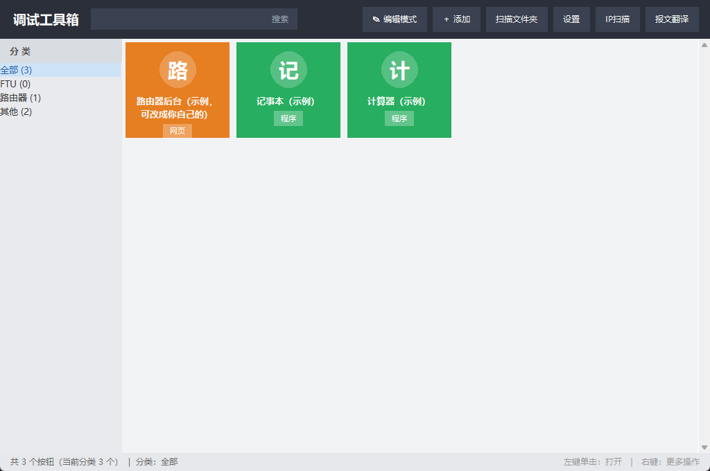
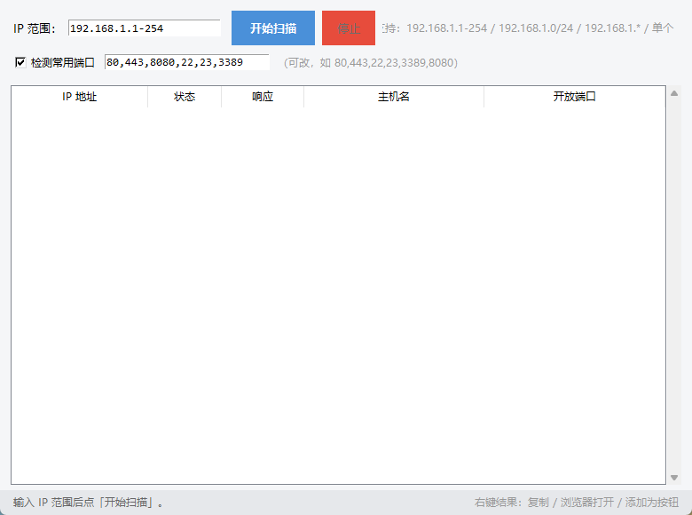
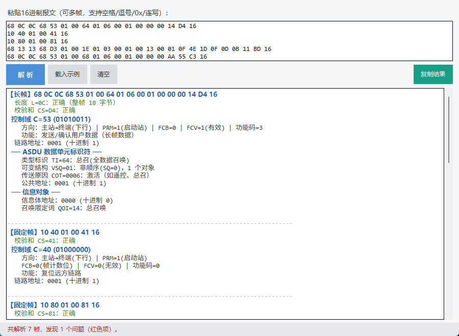

# 调试工具箱（Debug Toolbox）

一个类似「图吧工具箱」的集成式快捷启动器，专为配电自动化/FTU 调试人员设计：
把常用软件集中成彩色按钮，点击即可打开，省去每次到文件夹里翻 exe 的麻烦。



## ✨ 功能特性

### 1. 快捷启动
- **本地程序**（.exe 等）：一键启动，可勾选「以管理员身份运行」
- **网址 / 路由器后台**：用默认浏览器打开，**直接填 IP 也行**（如 `192.168.1.1` 自动补全 http://）
- **文件夹**：直接在资源管理器中打开
- 按钮的**名称、路径、分类、颜色、图标**全部可自定义
- **扫描文件夹**：自动把总目录下各厂家子文件夹里的程序生成按钮，厂家名自动变分类

### 2. IP 扫描（类 Angry IP Scanner）

- 支持 `192.168.1.1-254` / `192.168.1.0/24` / `192.168.1.*` / 单个 IP
- 并发 Ping 探测在线设备，显示响应时间、主机名
- 可选检测常用端口（80/443/8080/22/23/3389 等），**快速找到路由器/设备的 Web 管理页**
- 右键结果：复制 IP / 浏览器打开 / **一键添加为工具箱按钮**

### 3. 16进制报文翻译器（平衡101规约 + 国网安全报文）

- 支持固定帧（10…16）和长帧（68 L L 68…16）混贴多帧解析
- 逐字段翻译：控制域（方向/FCB/FCV/DFC/功能码）、链路地址、类型标识 TI、传送原因 COT、公共地址、信息对象
- 解码 7 字节时标（CP56Time2a）、短浮点遥测、遥控选择/执行、总召、SOE、时钟同步、测试命令等
- **国网安全报文**（EB…D7）：报文类型、应用类型（0x00~0x76）、随机数/签名/时间、业务/安全错误码，明文内嵌的 101/104 报文继续递归翻译
- 自动**校验和验证、帧长度检查、完整性检查**，红色高亮问题项（校验和错、长度不符、报文截断、未知类型等）

### 4. 更新提示（在线检查版本）
- **每次启动自动检查更新**（可在设置里关闭）：发现新版本会弹窗提示
- 设置 → 在线更新 → **检查更新**：显示当前/最新版本
- 有新版时点 **「下载新版」**，用浏览器打开 GitHub 下载页，下载新版覆盖当前程序即可

## 📦 使用

### 直接使用 exe（推荐）
下载 `调试工具箱.exe` 双击即用，无需安装 Python。
> 个别杀毒软件可能误报单文件 exe，加入信任即可。

### 源码运行
需要 Python 3.8+：
```
python 调试工具箱.py
```

## 🔄 如何发布新版本（发版流程）

1. 修改代码，`python 调试工具箱.py --selftest` 自检
2. 重新打包：`pyinstaller -F -w --icon icon.ico --name 调试工具箱 调试工具箱.py`
3. 更新 `version.json` 中的版本号（如 `1.0.1`）
4. 提交并推送（或双击仓库里的 `同步到GitHub.bat`）：
   `git add -A && git commit -m "v1.0.1" && git push`
5. 用户端下次启动会自动提示"发现新版本"，点「下载新版」到 GitHub 下载

## 📁 文件说明

| 文件 | 说明 |
| --- | --- |
| 调试工具箱.exe | 打包好的程序（直接下载使用） |
| 调试工具箱.py | 主程序源码 |
| ip_scanner.py | IP 扫描模块 |
| hex_translator.py | 报文翻译模块 |
| updater.py | 在线更新模块 |
| 启动调试工具箱.bat | Python 版启动脚本 |
| config.example.json | 配置模板（复制为 config.json 使用） |
| version.json | 当前版本号（在线更新读取） |

## ⚠️ 注意

- `config.json`（个人按钮配置）不入库，请勿提交，避免泄露本地路径
- 报文翻译功能参考了《新版平衡101总结》《国网配电终端安全报文定义》等资料整理，现场请以装置说明书为准
